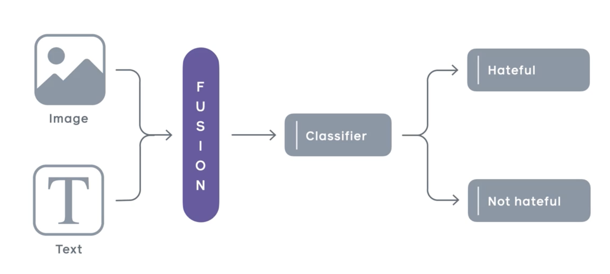

# Hateful Meme Detection

Memes are widely spread on social media platforms and consist of texts and graphics to create humor. Unfortunately, sometimes memes uploaded on the Internet need to be censored to curb hate speech. This poses a new challenge for multimodal classification which requires both visual and linguistic understanding of the meme. We find that using textual summarizations of the memes along with the text embedded in the image can help language models determine if the meme should be considered hate speech.

We used the BERT (Bidirectional Encoder Representations from Transformers) model as the baseline for our hateful meme detection project. To enhance the model's performance, we conducted a series of experiments involving the extraction of entity, emotion, race, gender, and age tags from the meme image. These visual features were fused with the meme's text to provide a more comprehensive input representation.

## Infrastructure Setup

For any deep-learning project, having a strong infrastructure is really important. We faced multiple challenges initially using Google Collab as it had very limited GPU support and often timed out. Hence we decided to move away from Google Collab and leveraged the following infrastructure (athough we were still limited by the credits available to us for GCP):

1. GCP vm instance with GPU - 1 x NVIDIA Tesla A100
2. GCP buckets to store results from model training and evaluation.
3. Jupyter notebook set-up on GCP vm

## Experiment Details

1. **Baseline BERT Model:** We started with the BERT model as the initial baseline. The model was trained on meme text without any additional visual features.

2. **Extracting Visual Features:** In our subsequent experiments, we extracted entity, emotion, race, gender, and age tags from the meme image. These tags provided valuable visual information about the content of the memes.

3. **Fusing Visual Features with Text:** We fused the extracted visual features with the meme's text to create one short paragraph to summarize the meme. This fusion allowed the model to leverage both textual and visual information during training and prediction.

4. **Hyperparameter Tuning:** To find the optimal configuration, we performed hyperparameter tuning, adjusting various parameters such as learning rate, batch size, and number of training epochs. This process aimed to achieve the best possible test accuracy.

## Model Performance

After conducting the experiments and fine-tuning the model, we achieved a test accuracy of 0.674. This indicates that the model performed reasonably well in detecting hateful memes, considering the complexity and challenges of the task.

## Conclusion

The combination of BERT as the base model and the integration of entity, emotion, race, gender, and age tags from the meme images significantly improved the model's performance. By leveraging both textual and visual features, the model was better equipped to identify hateful content in memes.

The obtained accuracy of 0.674 is promising and reflects the effectiveness of our approach. We will continue to explore additional strategies and potential enhancements to further boost the model's accuracy and robustness.

## Future Work

Our future work includes investigating other state-of-the-art models, exploring advanced feature engineering techniques, and potentially incorporating more diverse datasets to improve the model's performance and generalization.

If you have any questions or would like to learn more about our findings, feel free to reach out to us.
